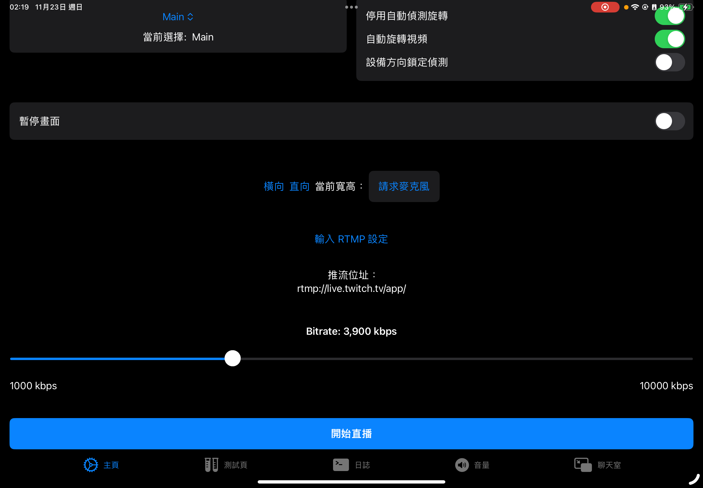
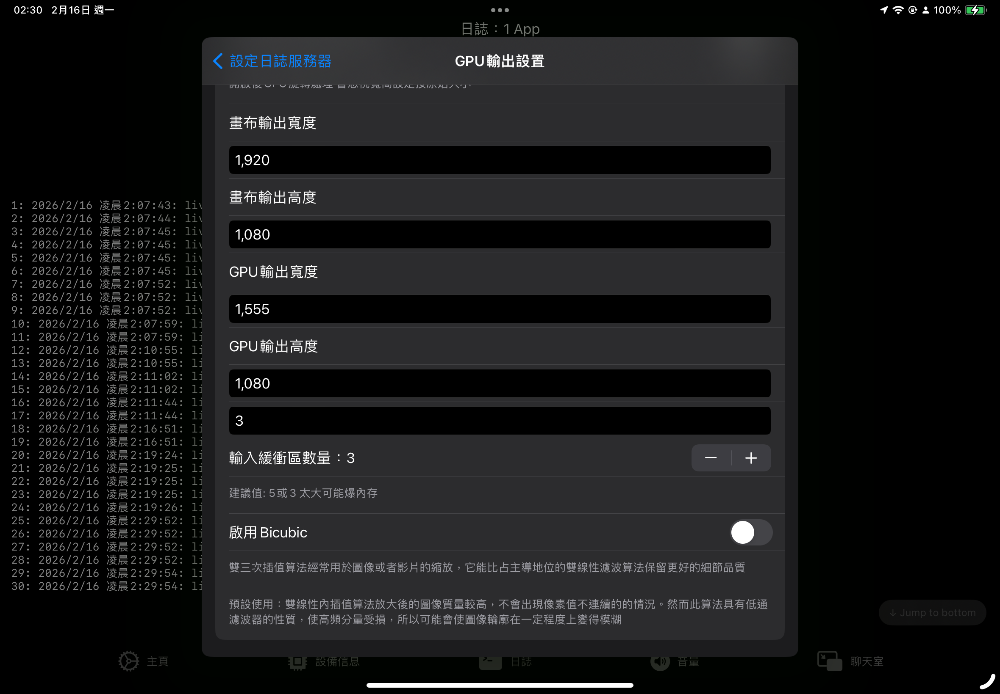
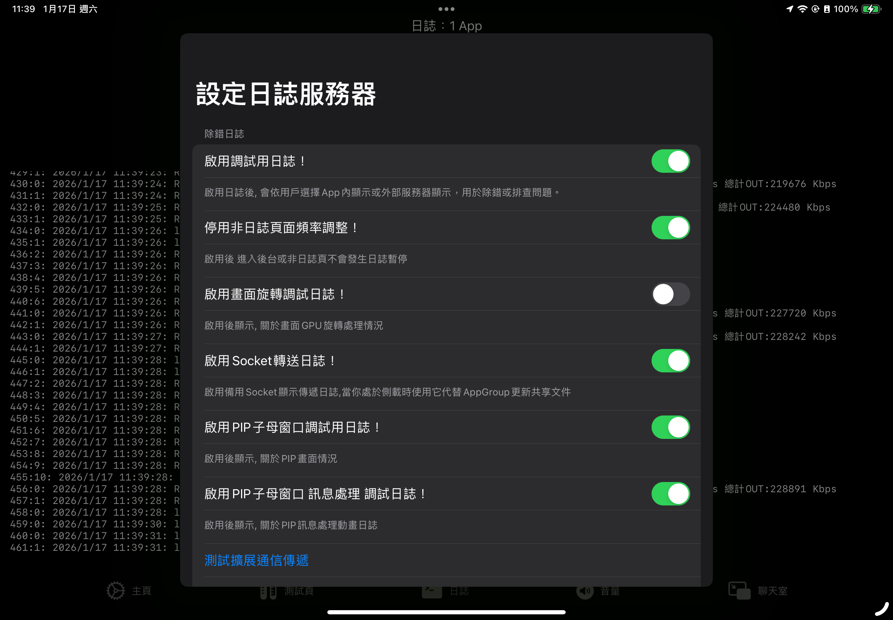
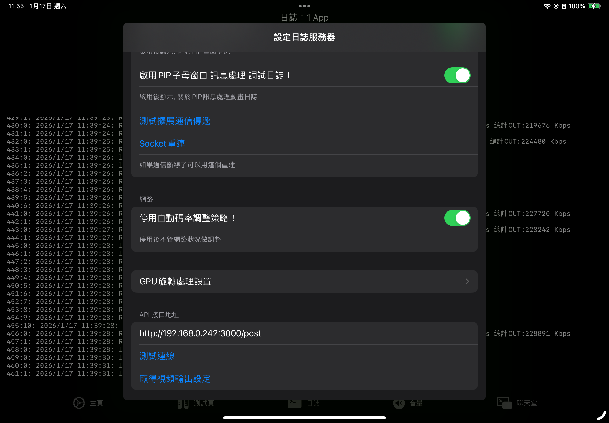
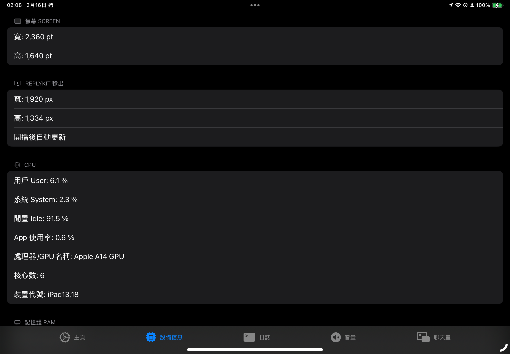
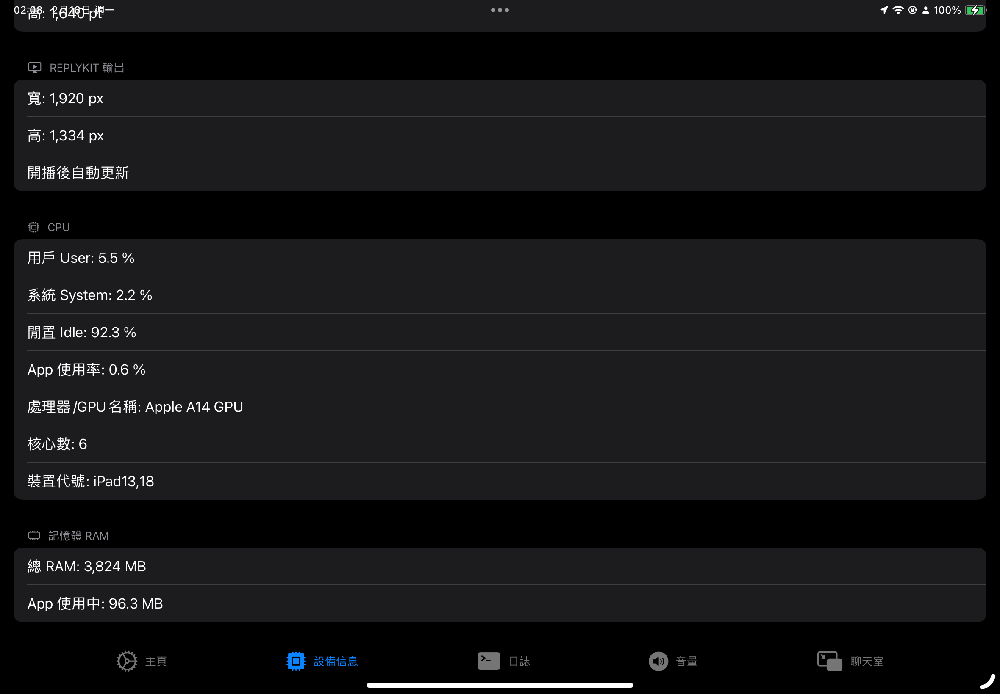
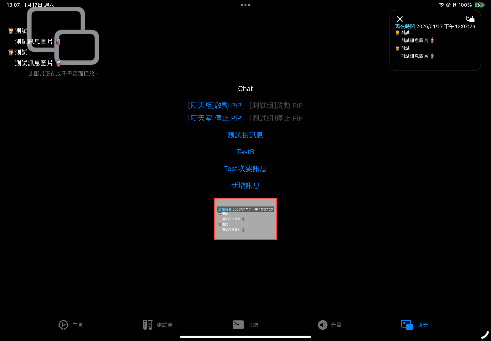

# 松鼠🐿️推流

  適用於iOS的直播推流應用

最近註冊了 愛發電有興趣可以去看看

[愛發電 快樂大松鼠](https://ifdian.net/a/coffee0709)


> [!WARNING]
> 從版本 **9.2.4** 之後 屬於**極度不穩定**狀況
> 
> 目前正在對底層做大改動修繕 可用性待平估
>
> 正在盡快完成**穩定修繕**

<p float="left">
  
  
</p>

> [!WARNING] 
> 說明文件不即時 由於後續更新迭代多次 
> 
> 文檔可能沒有更新 所以實際包含功能會有所區別

---

## 2026.06.19 重大修復：PTS 時間軸不一致導致部分平台無法推流

### 問題發現

在排查「部分 RTMP 平台一直推不上去」的問題時，發現影像 Pipeline 存在多個關鍵缺陷：

#### P0. 影音 PTS 使用不同 Timebase（最嚴重）

| 管線 | 使用的 PTS | 位置 |
|------|-----------|------|
| 影片 | 虛擬牆鐘 `CACurrentMediaTime() - startTime` | `VideoProcess.swift` |
| 音訊 | ReplayKit 原始 `presentationTimeStamp` | `AudioProcess.swift` |

影片用 `CACurrentMediaTime()` 造假 PTS，音訊保留 ReplayKit 原始 PTS，兩者為**完全不同的 timebase**。嚴格 RTMP 伺服器/CDN 遇到 A/V PTS 在不同時間軸上跳動時，會直接斷流拒絕。

#### P0. 重連後 PTS 歸零

`VideoFrameProcessor` 的 `startTime` 在 init 時固定為 `CACurrentMediaTime()`。Broadcast Extension 重啟時（`broadcastFinished` → `broadcastStarted`），新的 Processor 產生新 `startTime`，PTS 從 0 重新開始。多數 RTMP 伺服器要求 PTS 嚴格單調遞增，歸零 = reject。

#### P0. 寫死 60fps Frame Duration

```swift
let cfduration = CMTime(seconds: 1.0 / 60.0, preferredTimescale: 600)
```

無論實際幀率多少，duration 始終為 1/60s。VFR（可變幀率）場景下送出錯誤的時間資訊。

#### P1. 無 Backpressure 控制

每幀以 `Task { }` 非同步 dispatch，GPU Rotator 處理不及時 frame 無限積壓，增加記憶體壓力與延遲。

#### P1. 多次重複 videoSettings 套用

`broadcastStarted` 中 `configureVideo_init()` → `configureVideo(sampleBuffer)` → publish 前又手動設一次，總共三次 `setVideoSettings()`，每次可能觸發 encoder 重建造成串流中斷。

#### P2. allowFrameReordering = false

限制編碼器不允許 B-frame，對部分伺服器反而有相容性問題。

#### P2. frameInterval 未設定

`VideoCodecSettings.frameInterval` 預設 0.0（自動），但 `expectedFrameRate` 已設 60fps，應明確設定 `frameInterval = 1/60`。

### 修正內容

#### VideoProcess.swift

| 修改 | 說明 |
|------|------|
| 移除 `startTime` | 不再使用牆鐘造假 PTS |
| 改用 `oringinaltime.presentationTimeStamp` | 與音訊使用同一 ReplayKit timebase |
| 改用 `oringinaltime.duration`（有效時）| 寫死 60fps → 真實 frame duration |
| 加入 inflight counter（上限 4） | 超過即 drop frame，防止 GPU 積壓 |

#### SampleHandler.swift

| 修改 | 說明 |
|------|------|
| `allowFrameReordering = true` | 允許 B-frame，與主流伺服器相容 |
| 移除 publish 前重複的 `setVideoSettings()` | 避免 encoder 反覆重建 |

---

## 2026.06.19 底層 HaishinKit 修復（RTMP 協定層）

在持續追蹤「部分平台推不上去」的問題時，往下排查到依賴的 HaishinKit fork 底層，發現兩個 Critical bug：

### 🔴 C1. Chunk `.two` Header 寫入範圍錯誤

**檔案**: `RTMPHaishinKit/Sources/RTMP/RTMPChunk.swift:305`

```swift
// ❌ ClosedRange：4 bytes 範圍但只寫入 3 bytes，第 4 byte 保留舊資料
data.replaceSubrange(position...position + 3, with: message.timestamp.bigEndian.data[1...3])
// ✅ Half-open range：精準 3 bytes
data.replaceSubrange(position..<position + 3, with: message.timestamp.bigEndian.data[1...3])
```

`.zero`（line 289）和 `.one`（line 298）正確使用 `..<` half-open range，唯獨 `.two` 誤用 `...` ClosedRange。導致第一個 `.two` chunk 送出後，下一個 chunk 的 basic header 被污染，串流資料從該點開始損毀。

**影響**: 對 RTMP 協定實作嚴謹的伺服器（如部分 CDN、Wowza、自研 server）在此刻斷流。

### 🔴 C2. E-RTMP（Enhanced RTMP）參數預設送出

**檔案**: `RTMPHaishinKit/Sources/RTMP/RTMPConnection.swift:261-263`

```swift
// ❌ 預設送出 fourCcList / videoFourCcInfoMap / audioFourCcInfoMap
fourCcList: [String]? = RTMPConnection.supportedFourCcList,
videoFourCcInfoMap: AMFObject? = RTMPConnection.supportedVideoFourCcInfoMap,
audioFourCcInfoMap: AMFObject? = RTMPConnection.supportedAudioFourCcInfoMap,
```

建制 `RTMPConnection()` 時這三個參數預設為非 nil，connect command 中會夾帶 `"capsEx"`、`"fourCcList"` 等 Enhanced RTMP 欄位。不支援 E-RTMP 的伺服器收到未知欄位時可能直接拒絕連線。

**修正**: 預設值改為 `nil`，只有呼叫端明確傳入時才送。

### 其他一併發現的問題

| 問題 | 位置 | 嚴重性 | 說明 |
|------|------|--------|------|
| Timestamp 嚴格小於（`<`）而非小於等於 | `RTMPTimestamp.swift:21` | 🟡 | 重複 PTS 會 throw → frame 被靜默丟棄 |
| DTS 優先於 PTS 作為 RTMP timestamp | `RTMPStream.swift:764` | 🟡 | B-frame 場景送出錯誤的 presentation time |
| CTS 任意加 66ms offset | `RTMPMessage.swift:465` | 🟡 | A/V 不同步約 2 frames |
| Handshake C1 timestamp 永遠送 0 | `RTMPHandshake.swift:23` | 🟡 | 部分伺服器驗證此欄位 |
| `setVideoInputBufferCounts` 僅為 stored property setter | `StreamConvertible.swift:82-84` | 🟡 | **確認**：只在 publish() 前有效，runtime 無效 |
| 無 send buffer limit | `RTMPSocket.swift:86-112` | 🟡 | 慢網環境記憶體無限增長 |
| No keep-alive/ping | `RTMPConnection.swift` | 🟢 | 部分負載均衡器逾時斷連 |

---

## 2026.06.20 語音通話與直播共存

支援直播過程中同時進行語音通話（VoIP / LINE 通話 / 自建語聊），不中斷背景音樂播放。

### 啟用方式

```swift
// App 層（broadcastStarted / broadcastStarted）
RPScreenRecorder.shared().isMicrophoneEnabled = false  // 關閉 ReplayKit mic，避免雙重音源
try? await mediaMixer.setVoiceChatEnabled(true)
```

### 架構

| 元件 | 職責 |
|------|------|
| `AudioRouteManager` (iOS 限定) | 設定 AVAudioSession `.playAndRecord` + `.voiceChat` mode + `.mixWithOthers` + `.allowBluetooth` + `.defaultToSpeaker`；啟動 `AVAudioEngine` inputNode tap，將 mic PCM buffer 以 `Task { await mediaMixer.append(buffer, when:) }` 餵入現有音訊 pipeline |
| `MediaMixer.setVoiceChatEnabled(_:)` | 公開 API，內部呼叫 `AudioRouteManager.activate()` / `deactivate()` |
| `stopRunning()` | 自動停用 voice chat、釋放 engine、恢復 AVAudioSession `.playback` + `.mixWithOthers` |

### App 層需自行處理

1. **ReplayKit mic 雙重來源** — 啟用 voice chat 時，務必設 `RPScreenRecorder.shared().isMicrophoneEnabled = false`，只讓 ReplayKit 提供 `.audioApp`，mic 由 AVAudioEngine 負責
2. **通話下鏈（聽對方聲音）** — 由 app 自行管理（例如 `AVAudioEngine` mixer node 或系統 audio unit），本 SDK 僅處理 mic 上鏈
3. **Bluetooth 相容** — `.allowBluetooth` 確保藍牙耳機 mic 可用於通話

---

## HaishinKit Fork

推流引擎已切換至自行維護的 fork：

- **Repo**: [TwhomeGH/HaishinKitFixSwfit](https://github.com/TwhomeGH/HaishinKitFixSwfit)
- **修正內容**: VBR iOS 13+ 支援、Quality mode、VBV 參數、ABR 演算法改善、NetworkMonitor 擁塞檢測強化
- 完整改動說明請見 [CHANGES.md](https://github.com/TwhomeGH/HaishinKitFixSwfit/blob/main/CHANGES.md)


## 問題應對方案 

如果你遇到一些奇怪的問題 可以先看Wiki頁\
有些問題 已被發現記載在此

[常見問題處理方式 - Common Problem Solutions](https://github.com/TwhomeGH/ReplyKit/wiki)

## 重新設計 音訊處理 新增了降噪功能&回音消除

降噪處理增加 以及包含回音處理

> [!WARNING]
> App增益被列為棄用 未來將移除
>
> 由於此項會造成回音消除 處理過頭
> 
> 回音消除的基準應保持原始數據


## 視頻碼率分析 🎬

為了方便直播主或壓片組更便捷地使用，提供了**視頻碼率分析**功能：

- **選取視頻**：支援從相簿或檔案 App 選取視頻
- **詳細碼率資訊**：顯示平均碼率、視頻軌碼率、音頻軌碼率、編碼格式、解析度、幀率等
- **圖表化展示**：使用 Swift Charts 呈現碼率對比柱狀圖與碼率隨時間變化折線圖
- **快速診斷**：協助判斷原始視頻品質，作為直播推流參數配置參考

### 未來計畫

- **壓縮轉碼功能**：提供影片壓縮與轉碼功能，最大化效益，讓直播主與壓片組能直接在 App 內完成影片最佳化


## 最新重寫更新說明

本次針對 `ReplyKIT/rotateNV12.metal` 內的 `rotateNV12_bilinear` 與 `rotateNV12_bicubic` 重新整理了畫面旋轉與縮放對齊邏輯。

主要修正內容如下：

- 將輸出座標回推來源座標的流程改為統一使用中心點計算，避免旋轉時以左上角為基準造成畫面偏移
- 修正 4:3 畫面在 16:9 輸出下進行等比例適應時的對齊問題，例如 `1920x1334 -> 1920x1080` 會正確置中並保留左右黑邊
- 修正 `90` / `270` 度旋轉在目前畫面座標系下上下顛倒的問題
- 讓 `bicubic` 的 Y 平面取樣改回正確的 pixel-space 座標，避免取樣位置錯誤
- 調整 NV12 的 UV plane 寫入方式，改為每個 2x2 區塊只寫一次，避免多個 thread 同時寫入同一個 UV pixel 導致色度對齊不穩

這次重寫的重點是讓 GPU 旋轉後的輸出在不同長寬比、不同方向下都能維持正確的置中、縮放與色度對齊。


[版本標記說明 Version Note](./Docs/version.md) · [本地建置工作流程 Build Workflow](./Docs/workflow.md)

## LogView 頁面切換卡死修復 + 設備信息頁增強

### 問題

切換到「日誌」或「音量」頁面再切走時，LogView 的 Coordinator 仍持續在背景處理 log 訊息：
- `appendWorkItem` 持續排入 main queue
- `shouldAutoScroll` 永不關閉（無 `onDisappear`）
- 大量 UITextView 操作佔用主執行緒，造成 App 卡死

### 修改

#### LogView（`ContentView.swift`）

- 補上 `.onDisappear` → 設 `isVisible = false`、`shouldAutoScroll = false`、取消 pending work item
- `appendMessages()` 開頭檢查 `isVisible`，不在背景時直接 return
- 新增 `cancelPendingWork()` 方法清除排隊訊息

#### 設備信息頁（`OtherView.swift`）

重新設計 `DeviceView`，加入即時圖表與更多系統資訊：

| 項目 | 內容 |
|------|------|
| CPU 折線圖 | App CPU 使用率歷史 60 秒，搭配 SystemCPU 系統/用戶/閒置率 |
| RAM 折線圖 | App 記憶體用量歷史 60 秒 |
| 儲存空間 | 總容量 / 已使用 / 可用 GB |
| 網路介面 | WiFi / Cellular / No Connection |
| 系統資訊 | iOS 版本、開機時間、電量、電池狀態 |
| GPU | Metal 裝置名稱 |

## 統一 videoSettings 套用流程 + 移除 bitrate 雙路徑

### 問題

1. **configureVideo_init() 設定不完整** — 只設了 videoSize + 寫死 `High_AutoLevel`，profileLevel/bitRateMode/keyFrameInterval 都沒設。第一次 frame 到來時 `configureVideo(_:)` 才補齊，但 publish 早已送出 metadata 不正確。
2. **attemptReconnect() 完全沒套 videoSettings** — 新建 `RTMPStream` 後直接 publish，encoder 用 HaishinKit 預設（854x480, profile Auto）。
3. **configureVideo(_:) 內重複 100+ 行** — profileLevel switch / bitRateMode / keyFrameInterval / allowFrameReordering 等邏輯跟 `configureVideo_init()` 重複。
4. **Bitrate 有兩條獨立路徑** — Darwin notification `bitRateChange` 更新 strategy max，Socket `applyRTMP` 直接設 encoder bitrate，兩者不同步。

### 修改

#### 新增共享函式

`applyAllVideoSettings(width:height:stream:setSize:)` — 一次套用所有設定：

- profileLevel（根據使用者選擇的 h264level + 解析度計算）
- scalingMode
- videoSize（可選，由 setSize 控制）
- expectedFrameRate
- bitRateMode（ABR / CBR / VBR）
- maxKeyFrameIntervalDuration
- allowFrameReordering
- isLowLatencyRateControlEnabled
- bitRate
- streamStataus.mamimumVideoBitRate (strategy max)

#### 三個呼叫點

| 呼叫點 | 原本行為 | 現在 |
|--------|----------|------|
| `configureVideo_init()` | 只設 videoSize + 寫死 AutoHigh | 呼叫 `applyAllVideoSettings`，完整套用 |
| `attemptReconnect()` | 完全沒設任何 videoSettings | 先 `applyAllVideoSettings(stream: newStream)` 再 publish |
| `configureVideo(_:)` | 內聯 100+ 行重複邏輯 | 呼叫 `applyAllVideoSettings(setSize: false)` + 自己處理 orientation |

#### Bitrate 統一

- 移除 `bitrate` property + didSet
- 移除 `bitRateChange` Darwin notification handler
- `Eventlisten.swift` 移除 "bitRateChange" 註冊
- `applyAllVideoSettings()` 同時設 `videoSettings.bitRate` + `streamStataus?.updateVideoBitRate(to:)`

現在 bitrate 只有 socket 一條路：`GetRTMPConfig` → `applyRTMP` → `updateState` → `applyAllVideoSettings`，encoder 與 strategy max 在同一個點更新。

#### stateQueue 移除

- `Event.swift` 移除 `stateQueue.sync`（writes 有鎖 reads 沒鎖，等於白加，還可能 deadlock）

## Metal Shader 品質改造：float 精度 bicubic + unsharpen mask 後處理

### 問題

大動態畫面（快速運鏡、激烈運動）時，影像邊緣模糊、細節丟失。主要原因有二：

1. **Bicubic 插值使用 `half` 精度** — Catmull-Rom 三次係數在 `half`（10-bit 尾數）下運算會產生約 0.25 grey level 的捨入誤差，尤其在係數累加（~0.01~2.0 動態範圍）時誤差更明顯
2. **Interpolation 本身是平滑濾波** — 無論 bilinear 或 bicubic，旋轉+縮放後高頻細節會被自然衰減，缺少細節增強機制

### 修改

#### `rotateNV12.metal`

**Bicubic 全精度化：**

| 函數 | 修改前 | 修改後 |
|------|--------|--------|
| `catmullRom1D` | `half4` → `half` | `float4` → `float` |
| `catmullRom1D_uv` | `half2` → `half` | `float2` → `float` |
| `bicubicSampleY_16tap` | `half4 rows[4]`，`half4 col` | `float4 rows[4]`，`float4 col`，`float(tex.sample(...))` |
| `bicubicSampleUV_16tap` | `half2 rows[4]`，`half2 col[4]` | `float2 rows[4]`，`float2 col[4]`，`float2(tex.sample(...))` |

Texture read 維持 `half`（`r8Unorm` / `rg8Unorm` 本身就是 8-bit），但在進入算術運算前立即提升為 `float`，避免 interpolation 權重的累加誤差。

**新增 `unsharpY` kernel：**

```
kernel void unsharpY(
    texture2d<half, access::sample> srcY,   // 旋轉後的 Y
    texture2d<half, access::write>  dstY,   // sharpen 後的 Y
    constant float& amount,                 // 強度（0.0 ~ 0.5）
    uint2 gid)
```

演算法：
1. 3×3 Gaussian blur（未歸一化權重：中心 4、鄰邊 2、對角 1，總和 16）
2. `sharpened = center + amount × (center − blurred)`
3. Clamp 到 [0.0, 1.0] 後寫回

使用 `coord::pixel` 模式的 nearest sampler，避免多餘的正規化計算。

#### `GPUVideoRotator.swift`

- 新增 `sharpenPipeline: MTLComputePipelineState?` — `buildComputePipeline()` 中新增 Pipeline C
- 新增 `tempYTexture: MTLTexture?` — 避免同一個 command buffer 內讀寫衝突（rotation 寫 tempY → sharpen 讀 tempY 寫 dstY）
- `ensureMetalResources()` 的 guard 納入 `sharpenPipeline == nil` 檢查
- `cleanupResources()` 一併清理 sharpenPipeline + tempYTexture
- `renderPlaneYUV()` 內部根據品質模式決定 sharpen 強度

### 品質模式疊加

| 模式 | Interpolation | Unsharp | 行為 |
|------|-------------|---------|------|
| `.live`（預設） | Bilinear | 0.15（輕度） | 低運算成本 + 基本細節補救 |
| `.quality`（Bicubic） | Bicubic（float） | 0.25（中度） | 高精度插值 + 顯著細節增強 |

### 效果

- **float 精度的 bicubic**：消除係數捨入誤差，在平滑漸層區域有更乾淨的 interpolation
- **Unsharpen mask**：在不改變 interpolation 方式的前提下，主動恢復被平滑的高頻邊緣
- **兩 pass 獨立**：`unsharpY` 與 rotation kernel 分屬不同 compute encoder，中間依賴 implicit barrier 確保資料正確性

## 修復 Socket 連線穩定性與首次推流解析度錯誤

### 問題描述

1. **首次推流解析度錯誤**：第一次推流時常變成 854x480，而非用戶指定的解析度（如 1920x1080）
2. **Socket 死連接/殘留 Listener**：切換直播後舊連線未完全清理，導致新連線無法正常通訊

### 根因分析

**854x480 錯誤解析度：**
- 當 `socket` 請求回傳的 `ODWidth`/`ODHeight` 與 `ADWidth`/`ADHeight` 皆為 0 時，`configureVideo` 跳過解析度設定，HaishinKit 使用預設 854x480
- `SocketClient` 在連線尚未 `.ready` 時就發送 batch 請求，導致首次推流常 timeout 或拿到空配置

**Socket 死連接：**
- `SocketServer.isRunning` computed property 有副作用（直接 `listener.cancel()`、`listener = nil`），造成多次存取時的 race condition
- `receive()` callback 在 `removeConnection` 後仍可能執行，訪問已釋放的 buffer
- `SocketClient.setupConnection()` 直接覆蓋 `connection` 而不清理舊連線，舊連線的 receive 迴圈仍在背景運作
- `rtmpBatchContinuation` 等 continuation 在連線關閉時未清理，造成記憶體洩漏

### 修改內容

#### 1. SocketClient（`ReplyKIT/Socket.swift`）
- **setupConnection()**：先 closeConnection 清理舊連線再建立新連線
- **waitForReady(timeout:)**：新增 async 方法，等待連線 `.ready` 後才發送請求（3s timeout）
- **closeConnection()**：同步清理所有 pending continuation（rtmp、log、batch、ContinuationStore），避免洩漏
- **\_requestRTMPKEYAndLog() / \_requestRTMPKEY() / \_requestLogConfig()**：都先 await waitForReady() 再發送
- **ContinuationStore**：新增 cancelAll() 清理所有殘留的 continuation

#### 2. SocketServer（`liveAPP/Socket.swift`）
- **isRunning**：改為純 computed property，移除所有副作用
- **cleanupStaleListener()**：獨立方法處理 failed/cancelled listener 的清理
- **receive(from:)**：增加多層 `guard connections[id] != nil` 檢查，防止 callback 在連線移除後繼續處理
- **start()**：先調用 cleanupStaleListener() 再檢查狀態

#### 3. SampleHandler（`ReplyKIT/SampleHandler.swift`）
- **configureVideo_init()**：當 OD/AD 皆為 0 時，從 App Group UserDefaults 讀取 dstW/dstH 作為 fallback；若仍為 0 則設定 1280x720 預設值
- **configureVideo()**：相同 fallback 邏輯
- **broadcastStarted publish 前**：最終 videoSize 檢查也加入 UserDefaults fallback

## 修復 GPU 旋轉初始化失敗造成畫面無法送出 (0x0)

### 問題描述
推流畫面完全沒送出去，輸出為 0x0，編碼器無幀可編。

### 根因
`GPUVideoRotator.ensureMetalResources()` 在 `hasMetalResources` 設為 `true` 之後才進行實際資源初始化（textureCache、computePipeline）。若初始化失敗（如 GPU 暫時忙碌、shader 編譯失敗），函數回傳 `false` 但 flag 已永久鎖定為 `true`。後續所有幀的呼叫直接跳過初始化，使用 nil 資源，全部靜默丟棄。

### 修復
- **`hasMetalResources`**：改為在所有資源初始化成功後才設為 `true`
- **getReusableOutput 前**：加入 `dstW > 0 && dstH > 0` 保護，防止無效維度進入 GPU 管線

## 修復 Rotate 事件處理器維度條件錯誤

### 問題
`SampleHandler.swift:540,543` 使用 `||`（OR）而非 `&&`（AND）判斷 OD/AD 維度有效性。例如 `ODWidth=1920` 但 `ODHeight=0` 時，仍會設定 `NewVW=1920, NewVH=0`，造成 `videoSize` 單軸為 0。

### 修復
改為 `&&`，確保寬高同時有效才套用。

## 修復 broadcastStarted 維度混合問題

### 問題
`broadcastStarted` 中 ODWidth 與 ODHeight 獨立檢查（`ODWidth > 0 ? ODWidth : ADWidth`），可導致 OD Width 與 AD Height 被混合使用。

### 修復
改為成對檢查（OD 兩者 > 0 或 AD 兩者 > 0），維持維度一致性。

## 修復 OutW/OutH 分開觸發造成 videoSize 維度不一致

### 問題
`OutW` 與 `OutH` 是兩個獨立的 Darwin Notification，App 端先發 OutW、再發 OutH。
Extension 端原本的處理方式：
- **OutW** 只改 `videoSize.width`
- **OutH** 只改 `videoSize.height`

這導致 OutW 處理完、OutH 尚未到達的時間窗口中，`videoSize` 為 **(新寬度, 舊高度)** 的錯誤組合。
若編碼器在此時讀取，會得到錯誤解析度（如 854x480 或 0x0）。

### 修復
- **OutW/OutH 各自讀取雙維度**：兩個 handler 現在都同時讀取 `dstW` 與 `dstH`
- **0 值保護**：若任一維度為 0，則跳過本次更新，等待另一方補齊
- **原子設定**：`videoSize` 設為完整的 `CGSize(width:height:)`，不再分軸修改
- **雙軸同步**：`ADWidth`/`ADHeight` 與 `rotator.dstWW`/`dstHH` 同時更新

## 停用 AdaptiveVideoBufferManager

### 原因
經查閱 HaishinKit 原始碼，`setVideoInputBufferCounts` 僅為 **stored property setter**，
其設定的值只在 `videoInputStream` computed property 被存取時讀取一次。
而 `videoInputStream` 的 `for await` loop 在 stream 啟動時就已固定，**runtime 期間呼叫完全無效**。

### 修改
- 移除每幀對 `AdaptiveVideoBufferManager.monitorFPSAndAdjust` 的呼叫
- 保留初始化時從 `RPConfig.shared.state.BufferCount` 設定一次的邏輯（`configureVideo_init` 與 reconnect 處）

## 修復 Metal 管線中途失敗無自動重建

### 問題
`GPUVideoRotator` 的 `hasMetalResources` 一旦設為 `true` 就永久鎖定，
`ensureMetalResources()` 永遠直接 return，不會重試初始化。
若 GPU 中途重置或記憶體不足造成 texture/command buffer 建立失敗，
所有後續幀靜默丟棄，沒有任何復原路徑。

### 修復
`GPUVideoRotator.swift` 加入 `consecutiveMetalFailures` 計數器：

- `getReusableOutput` 失敗 → 計數 +1
- `makeTexture` / `makeCommandBuffer` 失敗 → 計數 +1
- 幀成功送出 → 計數歸零
- 連續失敗達 **5 次** → 自動呼叫 `cleanupResources()`，
  重置 `hasMetalResources`、textureCache、pipeline
- 下一幀的 `ensureMetalResources()` 會從頭重建整條 Metal 管線

## 新增可設定關鍵幀間隔（KeyFrameInterval）

### 問題
推流到 Restream 等平台時被拒，因為 `maxKeyFrameIntervalDuration` 原本鎖死在
位元率模式對應的固定值（ABR=3s, CBR=4s, VBR=2s），部分平台要求更嚴格的 GOP 規範。

### 修改
- `Setting.swift` 新增「關鍵幀間隔」文字輸入框（預設 2 秒）
- `SampleHandler.swift` 移除 per-mode 硬編碼，改為統一讀取 `RPConfig.shared.state.KeyFrameInterval`（支援 Socket 傳遞，側載用戶也可用）
- 值為 `0` 表示由編碼器自動決定（無最大間隔限制）

## 修復 h264ProfileLevel 在高解析度下回傳無效 Level

### 問題
`h264ProfileLevel` 中 Baseline 和 Main 的 switch 缺少中高階 Level 範圍。
對於 iPad 常見的 1920x1334 原始解析度（mbPerFrame≈10285），
兩者都跳進 `default` 回傳 `xxx_4_2`，但 Level 4.2 最大只支援 8704 mb/frame。

- **Baseline 4.2**：H.264 標準中 Baseline 最高只到 Level 4.1，回傳 4.2 是非法的
- **Main 4.2**：10285 > 8704，超出 Level 4.2 規格，VideoToolbox 可能拒絕或編碼異常

### 修復
- **Baseline `default`** → 改為 `Baseline_AutoLevel`（讓編碼器自動選擇）
- **Main** → 補上 `8192..<8704`(4.2)、`8704..<36864`(5.0)、`>=36864`(5.1/5.2) 等完整範圍
- **High** → 維持不變（原本就有完整範圍）

## 改進音視頻管道處理

目前音頻帶降噪功能 可選使用Metal加速
當前設計 額外套用自動降級保護 如果GPU忙不過來會嘗試降級到CPU
如果到後面完全處理不過來 會嘗試原始音訊傳送
確保系統在某些異常負載下 能夠保持音訊正常

### 原始音訊管線效能優化 (2026/06)

當使用原始音訊模式（無降噪/回音消除/AGC）時，先前因以下問題導致音訊斷斷續續：

| 問題 | 修復 | 預期效果 |
|------|------|---------|
| `amplifySIMD` 每次呼叫 heap alloc Float buffer（每秒近百次 malloc/free） | 改用 per-track 預分配 `[Float]` buffer 重用 | 零 heap alloc，消除碎片化 |
| `retimeAudioBuffer` 每秒百次 shallow copy，但 99% 只用於 RMS（每秒才觸發一次） | 移入 `processRMS` 內部，只在真正需要時建立 | 每秒節省 ~99 次 CMSampleBuffer 物件建立 |
| Drop gate `isEnqueuing*` 跨線程無同步 data race | 加 `os_unfair_lock` 保護讀寫 | 消除誤掉幀，乾淨的 gate 語意 |

### GPU 密集型遊戲導致直播掉幀（已知 iOS 系統限制）

> [!NOTE]
> 測試遊戲：第五人格（活動子頁面 / 內嵌小遊戲場景）

當 GPU 密集型遊戲開啟高負載子頁面時，直播幀數可能瞬崩至 2-10 fps，遊戲本身不受影響，關閉子頁面立刻恢復。這是 iOS 系統級 GPU 排程行為：**前景 App 的 GPU 優先權永遠高於 ReplayKit 廣播擴展**。

`videoInputFrames`（RTMP 吞吐量 log）是 ReplayKit 交給我們的原始幀數。若此值持續低於 20 且 video processor 無異常（`[VProc] active:true processing:false`），即為系統節流，非本專案 bug。GPU 旋轉降級到 CPU 或降低碼率都無法改善（瓶頸在擷取端螢幕合成器，不在後處理）。詳見 `Docs/replykit-core-fixes-summary.md` §9。


## 修復音訊 Metal/CPU 反覆切換與 iOS 26 Beta Crash

### 問題發現

#### 1. GPULatencyTracker 永久鎖定（永不恢復 Metal）

`AudioNoiseMetal.swift` 的 `GPULatencyTracker` 在判定 GPU 過載後 (`isOverloaded = true`)，`record()` 只在 Metal 路徑被呼叫。一旦切到 CPU fallback，歷史記錄凍結，`isOverloaded` 永遠回不來，**音訊永久鎖在 CPU 模式**。

#### 2. AudioPreProcessor.processMic force unwrap crash（iOS 26 Beta）

`AudioNoiseFix.swift:489` 的 `metalNS!` 與 `AudioNoiseMetal.swift` / `AudioNoiseFix.swift` 共 7 處 `baseAddress!` force unwrap，在 iOS 26 Beta 下 Swift runtime 觸發 `EXC_BREAKPOINT` / `SIGTRAP`。

Crash 路徑：`RPBroadcastSampleHandler _processPayloadWithAudioSample:` → Audio pipeline FFT 處理 → `baseAddress!` force unwrap of nil

#### 3. VideoProcess sampleBuffer 長期持有

`VideoFrameProcessor.process()` 的 `sampleBuffer` 被 Task closure strongly capture，直到 GPU rotation 完成才釋放。ReplayKit 的 buffer pool 因此被阻塞。

### 修改

| 檔案 | 問題 | 修改 |
|------|------|------|
| `AudioNoiseMetal.swift:15-53` | `GPULatencyTracker` 永久鎖定 | 加入 3 秒冷卻機制：overload 後 CPU 模式 3 秒，期滿自動 reset 嘗試恢復 Metal |
| `AudioNoiseFix.swift:480-491` | `metalNS!` force unwrap | 重構為巢狀 `if let metalNS = metalNS`，消除 force unwrap |
| `AudioNoiseMetal.swift:204-268` | `baseAddress!` × 4 | 改為 `guard let` + graceful skip（不 crash，該 frame passthrough） |
| `AudioNoiseFix.swift:196-308` | `baseAddress!` × 3 | 同上 |
| `VideoProcess.swift:102-104` | sampleBuffer 被 Task capture | Task 前提取 `CVPixelBuffer`，使 CMSampleBuffer 即時回到 ReplayKit pool |
| `GPUVideoRotator.swift:502` | rotateAsync 需 CMSampleBuffer | 參數改為 `CVPixelBuffer`，與上述修改對應 |

---

#### 4. Metal 音訊與影片共用同一條 Command Queue 造成音訊撕裂

##### 問題
`MetalContext.shared.queue` 被 `AudioNoiseMetal`（音訊降噪）與 `GPUVideoRotator`（影片旋轉）共用。
影片渲染的 GPU command 塞在 queue 前端時，音訊的 noise suppression kernel 必須排隊等待，
導致 `runMetalKernelWithTimeout` 中的 `DispatchSemaphore.wait(timeout:)` 逾時或延遲，
音訊即時管線無法在 frame 週期內完成（512 samples @ 48kHz ≈ 10.67ms），
聽表現為音訊撕裂、爆音。

##### 修改
`AudioNoiseMetal.swift:132-139` — 不再取用 `MetalContext.shared.queue`，改為獨立建立一條
`metalDevice.makeCommandQueue()`，音訊的 GPU 指令不再被影片工作阻塞。

| 改前 | 改後 |
|------|------|
| `metalQueue = ctx.queue`（與影片共用） | `metalQueue = metalDevice.makeCommandQueue()!`（專屬音訊） |

### 行為對比

| 情境 | 改前 | 改後 |
|------|------|------|
| GPU 短暫過載 >8ms | 永久鎖 CPU | CPU 3s → 自動重試 Metal |
| GPU 持續過載 | 永久鎖 CPU | 每 3s 嘗試一次 Metal，持續失敗則持續停在 CPU |
| `baseAddress` 為 nil | `EXC_BREAKPOINT` crash | 安全跳過該 frame 處理，音訊 passthrough |
| ReplayKit buffer pool | 被 Task 長時間佔用 | 提早回收，減少 buffer 競爭 |

## 修復 VFR 造成的 PTS 異常與畫面速率抖動

### 問題發現

在分析一段長時間直播錄影時，發現影片從約 **54分30秒** 後出現嚴重的畫面速率異常：

- **ffprobe 分析結果**：`r_frame_rate=60/1`（聲稱 60fps）但 `avg_frame_rate≈100`，metadata 與實際不符
- **封包結構**：約 **70% 的幀是「微幀」**（duration = 0.000011s，僅 1 個 PTS tick），穿插在正常 0.016-0.017s 幀之間
- **觸發點**：~54:30 處編碼器嚴重卡頓（幀間隔高達 1.4s ~ 9.9s），恢復後即進入缺陷模式

### 根因分析

透過原始碼追溯，確認問題出在 **ReplyKIT 音視頻管線的三個設計缺陷**：

| 問題 | 位置 | 影響 |
|------|------|------|
| `allowFrameReordering=true` + VFR 輸入 | `SampleHandler.swift:2178` | VideoToolbox B-frame 重排序導致 PTS 損毀 |
| MediaMixer passthrough 無 CFR 轉換 | `SampleHandler.swift:1343` | VFR 原樣送入編碼器，不做 PTS 平滑 |
| `AdaptiveVideoBufferManager` 被註解 | `AdaptiveVideoBufferManager.swift` | 無動態 buffer 緩衝，過載時直接崩潰 |

**問題鏈**：
1. ReplayKit 本質是 **VFR**（畫面無變化就不送 buffer）
2. `MediaMixer` 設為 `passthrough`，不做任何 PTS 平滑
3. `allowFrameReordering=true` 讓 VideoToolbox 開啟 B-frame 重排序（`has_b_frames=15`）
4. 系統過載時 PTS 出現巨大間隔 → B-frame 重排序邏輯錯亂 → 輸出大量微幀
5. 編碼器恢復後從未修正，缺陷持續到結束

### 三層防禦改進

#### 1. 關閉 Frame Reordering

`SampleHandler.swift:2178` — 硬編碼為 `false`，並從配置項與 UI 完全移除：

```swift
videoSettings.allowFrameReordering = false
```

這阻止 VideoToolbox 做 B-frame 重排序，從根源避免 PTS 損毀。

#### 2. CFR 平滑（Constant Frame Rate）

`VideoProcess.swift` — 在 GPU 旋轉後、送入 MediaMixer 前，以 frameCount 產生恒定 PTS：

```swift
let correctedPTS = CMTime(value: frameCount, timescale: 60)
// ... CMSampleBufferCreateCopyWithNewTiming ...
frameCount += 1
```

無論 ReplayKit 以何種 VFR 送幀，編碼器永遠收到 0, 1/60s, 2/60s... 的恒定 PTS。

#### 3. 靜態 Buffer 設定（取代動態調整）

原 AdaptiveVideoBufferManager 提供的動態 buffer 管理已**停用**（經確認 `setVideoInputBufferCounts` 在 runtime 無效），
改為在初始化階段從 `RPConfig.shared.state.BufferCount` 設定一次：

- `configureVideo_init` 處設定初始值
- reconnect 建立新 stream 時重新設定

### 效果

這三層防禦形成完整保護：
- **第一層**：不允許 B-frame 重排序 → PTS 不會被編碼器亂序打亂
- **第二層**：CFR 強制修正 PTS → 無論輸入多亂，輸出永遠是 60fps 節奏
- **第三層**：靜態 buffer 管理 → 根據設備核心數與用戶設定選擇合理初始值

## 新增重連設計

當直播因網路問題 沒有連線成功 會最多嘗試重連 最多5次
也會顯示在子母窗口上 提示當前重連次數


主要是針對音畫時間軸校正

在最新版本目前加上音軌的PTS校正 雖然說音軌偏移照理說應該不會發生

但考量前幾個版本只對畫面做PTS校正 有概率在某些情況下可能出現異常

所以兩者皆補上了PTS修正


## 最新 PiP 背景存活與渲染效能優化

本次針對 PiP 子母畫面在背景被系統終止、動畫與渲染效能進行全面改善：

### 背景存活修復
- **PIPService**: 放寬 `attachToForegroundWindow` 綁定條件，接受任何已連接的 Scene
- **PIPService**: 新增 `handleMemoryWarning()`、background task 生命週期、app 前景/背景切換時自動重連 displayLayer
- **liveAPPApp.swift**: scenePhase `.background` 時註冊 `beginBackgroundTask`，`init()` 時監聽 Memory Warning 通知
- **Socket.swift**: 新增 `suspend()` / `resume()` / `releaseMemory()`，背景時釋放緩衝區、前景恢復運作

### 動畫迴圈重構
- 移除 `CADisplayLink`，改由 PIPService render timer 統一驅動，消除雙 loop 不同步
- 以 `tickAnimation()` 狀態機取代舊的 step 方法，動畫進行中持續回呼
- 穩定 FPS 策略：動畫中 30fps、有訊息/活動 15fps、閒置 1fps，取代舊的跳 60→衰減機制，消除 FPS 震盪

### Render Pipeline 最佳化
- 跳過 `UIGraphicsImageRenderer` → `CGImage` → `CIImage` → `CIContext.render()` 的兩次 round-trip
- 改為 `CVPixelBufferPool` + 直接 `CGContext(data:)` 將 CALayer tree 渲染到 pixel buffer 記憶體
- 移除不再使用的 GPU renderer、Metal device、CIContext 等 dead code


## AltStore 測試

以下示例版本是 **3.9.4**
<!-- you can set the alighnment here to left/center/right -->
<h1 align="left">
<a href="https://stikstore.app/altdirect/?url=https://raw.githubusercontent.com/TwhomeGH/ReplyKit/refs/heads/main/AltStoreTest.json">
</a>
<a href="https://github.com/TwhomeGH/ReplyKit/releases/download/3.9.4/liveApp_3.9.4.ipa">
</a>
</h1>

## 贊助支持

本專案為個人開發，致力於提供優質的直播推流應用。為了維持持續開發與更新，我們誠摯邀請您參與贊助支持。

### 贊助管道

目前支援以下贊助方式：

- **Twitch**: [https://twitch.tv/twhomegh](https://twitch.tv/twhomegh)

### 贊助用途

您的贊助將用於：
- 維持開發與更新
- 或支持其他項目開發
- 提升技術研發能力
- 開發新功能與改善體驗

### 感謝您的支持

感謝您對本專案的贊助，您的支持是我們持續開發的重要動力。

## 側載用戶說明

> [!WARNING]
> 由於本應用為側載安裝，**App Group 無法使用**，因此改以 **Socket** 作為資料傳遞替代方案。  
> 這可能導致首次啟動時，部分 `UserDefaults` 設定 **未能正確同步**，例如：
>
> - `AppVolume`  
> - `MicVolume`  
> - `Rotate`  
> - `主要與次要字體大小`
>
> 其中 **部分 AppVolume / MicVolume 已做額外修正**，因此首次啟動時不會影響實際使用。
> 主要與次要字體大小也可能丟失 導致子母窗口無法正常顯示訊息是空的
>
> 只需要稍微設置中上下微調即可修正

### Socket 轉送
請先開啟 **Socket 轉送** 功能。  

- 若首次啟動時 **沒有跳出「允許區域網路」權限提示**  
  請先**啟用調試日誌**（此操作會主動觸發本地 Socket 行為，從而喚起系統權限視窗）。  
  啟用後，將 App 從背景完全關閉並重新開啟，以重新觸發權限提示。
  
### GPU 處理方向
首次使用時，請務必 **手動更新一次 GPU 處理方向**。  

- 避免因預設值未正確填入而變成 `0`  
- 手動更新後即可正常套用正確數值


## 新增 TTS 佇列上限控制 (maxQueueSize)

### 問題
`AVSpeechSynthesizer` 無公開 API 查詢內部佇列深度，連續大量朗讀時佇列可能無限增長，
極端情況下導致記憶體壓力甚至崩潰。

### 修改
- `TTSService.swift`：新增 `maxQueueSize`（0=無限制/5/10/20/50）與 `queueOverflowAction`
- 透過 `AVSpeechSynthesizerDelegate`（`didFinish`/`didCancel`）維護 `pendingUtteranceCount`
- `stopSpeaking(at: .immediate)` 時手動重置計數為 0
- `speak()` 在佇列已滿時根據 `queueOverflowAction` 決定跳過新訊息或清空佇列
- `TTSSettingsView.swift`：設定頁面新增「佇列上限」Picker 與「佇列滿載」Picker
- 新增 `TTSQueueOverflowAction` 列舉 (skipNew / stopOld)

### 相關檔案
- `liveAPP/TTSService.swift`：佇列計數 + 上限控制 + delegate
- `liveAPP/TTSSettingsView.swift`：佇列設定 UI

---

## 修復 TTS 過濾器誤刪數字 + 新增純數字過濾選項

### 問題

`SpeechFilterManager.processMessage()` 在「移除表情符號」階段使用 `isEmoji` 過濾，
但 Swift 的 `UnicodeScalar.properties.isEmoji` 對數字 `0-9`、`#`、`*` 也回傳 `true`
（因為這些字元可以透過 Variant Selector-16 組合成 emoji keycap 序列，如 `#️⃣`、`0️⃣`），
導致朗讀時數字被誤刪。

### 修改

#### `TTSSettingsView.swift - SpeechFilterManager`

| 變更 | 說明 |
|------|------|
| `isEmoji` → `isEmojiPresentation` | `isEmojiPresentation` 只對「預設顯示為 emoji」的字元回傳 true，數字、#、* 不再被誤刪 |
| 新增 `removePureNumbers` 屬性 | 可選是否移除純數字內容，使用正則 `(?<!\d)\d+(?!\d)` 確保只移除獨立數字，保留「第5名」這類混合內容 |
| 新增儲存/載入 | UserDefaults 序列化新增 `removePureNumbers` 欄位 |

#### UI 新增

TTS 過濾器設定頁面新增「移除純數字」Toggle 開關。

---

## 修復 PIP unsafeBitCast 潛在崩潰

### 問題

`PIPService.swift:createSampleBuffer()` 中 `CFArrayGetValueAtIndex(attachments, 0)` 的結果
直接傳入 `unsafeBitCast`，若陣列為空則回傳 nil，`unsafeBitCast(nil, to:)` 會觸發 crash。

### 修改

在 `unsafeBitCast` 前增加 `CFArrayGetCount(attachments) > 0` 與 `rawPtr` nil 檢查，
確保只有有效指標才進行轉換。

---

## 修復 sendlog() 雙重快取不同步導致日誌靜默丟棄

### 問題

`Event.swift` 中的 `sendlog()` 依賴全局變數 `logState` / `onlogState`，這兩個變數
只在 `updateLogFixState()` / `updateONLogFixState()` 被調用時更新。
若 Extension 啟動時值尚未同步，即使 App 端已設為 true，擴展端仍認為 false，所有日誌被靜默丟棄。

### 修改

- 移除 `logState`、`onlogState` 全局變數及 `lastlogT`/`IntTime`
- `sendlog()` 改為直接讀取 `RPConfig.shared.enableLog` 與 `RPConfig.shared.onLogPage`
- `updateLogFixState()` / `updateONLogFixState()` 簡化為僅記錄日誌

---

## 修復 RTMP / Socket 重連耗盡後永久終止

### 問題

- RTMP 重連（`SampleHandler.swift`）上限 5 次 → 調用 `stopBroadcastWithError` 永久關閉推流
- Socket 重連（`ReplyKIT/Socket.swift`）上限 10 次 → 永久放棄重連

### 修改

超過上限後不退避，改為 **固定 30 秒間隔持續重連**，不再終止推流或放棄連線：

| 組件 | 上限後行為 (改前) | 上限後行為 (改後) |
|------|------------------|------------------|
| RTMP | `stopBroadcastWithError("RTMP 重連失敗")` | 每 30s 持續嘗試 |
| Socket | `return` (放棄) | 每 30s 持續嘗試 |

---

## 修復 RemoteLogBuffer 滿時無告警

### 問題

`RemoteLogBuffer` 最多暫存 300 筆，滿時靜默丟棄最舊日誌，無任何提示。

### 修改

每丟棄 50 條記錄一次 `sendlog("⚠️ RemoteLogBuffer 已滿")` 告警。

---

## 新增 TTSService 監聽音頻服務丟失

### 問題

`TTSService` 只監聽 `mediaServicesWereResetNotification`，缺少
`mediaServicesWereLostNotification`，無法在第一時間感知音頻服務中斷。

### 修改

新增 `AVAudioSession.mediaServicesWereLostNotification` 監聽，中斷時記錄日誌，
後續由 `mediaServicesWereResetNotification` 自動恢復。

---

## 修復首次 RTMP 連線容易失敗 (mediaMixer 時序競爭)

### 問題
`broadcastStarted()` 中 `configureMediaMixer()` 在 RTMP connect **之前**就呼叫了
`mediaMixer.startRunning()`，導致混音器立即開始產出 frame，但此時 RTMP 連線尚未建立。
HaishinKit 的 TCP timeout 為 15 秒，在這段期間 frame 持續積累，可能造成第一個 connect
超時失敗，進而仰賴重連機制才成功。

### 變更 (`SampleHandler.swift`)

| 位置 | 修正前 | 修正後 |
|------|--------|--------|
| `configureMediaMixer()` | `addOutput` + **`startRunning`** | 只保留 `addOutput` |
| `startRTMP()` 成功後 | (無) | 新增 `startRunning` |
| `attemptReconnect()` 成功後 | `addOutput` 後無 `startRunning` | `addOutput` + **`startRunning`** |

重連路徑也補上 `startRunning()`，避免極端情況（首次連線從未成功）下 mixer 永遠不啟動。

---

## 修復主 App 記憶體持續增長問題

### 問題

經實機監測發現主 App RAM 用量持續穩定上升，即使無明顯操作也不回落。

### 根因分析

全面審查所有 liveAPP target 中的集合類、緩衝區、定時器與單例，共找出以下記憶體洩漏或無界增長點：

| 嚴重性 | 問題 | 位置 | 說明 |
|--------|------|------|------|
| 🔴 | `ConfigManager.layers` 無界增長 | `liveAPP/Config.swift:13` | 每次 `push()` 永久追加新層，無 `pop()` 或容量上限 |
| 🔴 | `pendingFailedPayloads` 只增不減 | `liveAPP/Socket.swift:1111` | 斷線時暫存未送出 payload，但 `suspend()` / `releaseMemory()` / `stopInternal()` 皆未清理 |
| 🟠 | `stopInternal()` 漏清多個字典 | `liveAPP/Socket.swift:1198` | 關閉 Socket 時未釋放 `sendQueues`、`sendingFlags`、`pendingFailedPayloads` |
| 🟢 | `SocketServer` 缺 `deinit` | `liveAPP/Socket.swift` | listener 與 idleTimers 在物件釋放時無法自動取消 |

經檢查後確認已受控（無須修正）：
- `RemoteLogBuffer.buffer` → 上限 300 條，drain 後移除，失敗不回插
- `LogBuffer.buffer` → batch 100 條排出，排完 removeFirst
- `messageLines` → 上限 10000 行，超過砍半至 5000
- `PiPImageCache.inFlightTasks` → `finishDownload()` 正確清理
- `Socket.receiveBuffers` → `removeConnection()` / `suspend()` 皆有清理
- `LogModel.messages` → 上限 1000 條，超出移除最舊
- `OrientationObserver` → 單例存活整段 app 生命週期，observer 無須移除

### 修改

| 檔案 | 變更 |
|------|------|
| `liveAPP/Config.swift` | `push()` 加入 `maxLayers=10`，超出時移除最舊層（保留第 0 層 default） |
| `liveAPP/Socket.swift` | `suspend()` / `releaseMemory()` / `stopInternal()` 三處補上 `pendingFailedPayloads.removeAll()` |
| `liveAPP/Socket.swift` | `stopInternal()` 補上 `sendQueues.removeAll()` + `sendingFlags.removeAll()` |
| `liveAPP/Socket.swift` | 新增 `deinit`，取消 idleTimers 與 listener |

## TODO 待辦事項


- **子母畫面聊天室**  
    - [x] 實現聊天室畫面以 PiP (Picture-in-Picture) 方式呈現
    - [x] 確保聊天室訊息即時更新與渲染
    - [ ] 改善子母聊天室性能 目前性能似乎還是偏異常待改進

- **App Group 的替代方案**  
    - [x] 使用 Socket 同步擴展之間的參數變化
    - [x] 研究替代 App Group 的資料共享方法 目前使用Socket替代

- **視頻碼率分析**
    - [x] 視頻選取（相簿 / 檔案 App）
    - [x] 詳細碼率資訊展示
    - [x] 碼率圖表化（Swift Charts）
    - [ ] 壓縮視頻轉碼功能 以最大化效益
    

## 調試用設定


<p float="left">
  
  
</p>

## GPU旋轉處理設定

<p float="left">
  
  
</p>

### 為什麼需要旋轉處理？

由於原始 **ReplyKit** 只提供直向畫面，若需要橫向畫面，必須進行 GPU 畫面旋轉處理。  

### 可設定參數

- **畫布輸出寬高**：可自定義輸出畫面的寬度與高度
- **GPU輸出寬高**：可自定義GPU處理後輸出畫面的寬度與高度
- **配置名稱**：方便辨識用
- **選擇方向**：橫向直向
- **只改輸出寬高[畫布本身]**：開啟後GPU處理最終產物寬高與原始一致
- **輸入緩衝區數量**：太大會碰到擴展運存限制50MB 保持在3或5
- **插值方式**：使用 **Bicubic 插值**  
  - 運算較慢，但保留細節更好  
  - 對大動態畫面可減少模糊
  - 預設不使用 用線性即可

### 參考分辨率對應表

| 寬度 | 高度 | 解析度 |
| --- | --- | --- |
| 1034 | 720  | 720p  |
| 1552 | 1080 | 1080p |

## 音訊設定


在此頁面，你可以：

- **控制麥克風或應用的增益與音量大小**  
- **查看直播時的實際輸出音量**，方便即時監控音訊狀態

## 日誌服務




- **啟用調試日誌**

  除錯用日誌

- **停用非日誌頁面頻率調整**
  
  停用後在非日誌頁會保持更新

- **啟用畫面旋轉日誌**
  
  啟用後可以查看關於畫面處理信息


- **啟用Socke轉送日誌**

>  [!WARNING]
>  此選項是給側載用戶 由於側載AppGroup就不可用 
>  需要用Socket作為轉送橋梁
>
>  啟用後他會把日誌以Socket送回來
>  以及依賴AppGroup更新音量等的部分會用Socket取得新配置


- **啟用PIP子母窗口**

  PIP的每秒處理張數情況

- **啟用PIP子母窗口訊息處理**

  PIP的收到訊息後處理情況
  


- **測試擃展通信傳遞**

  用於測試擃展通信情況

- **Socket重連**

  如果Socket斷線 可用於重新連接

- **停用自動碼率調整**

  停用後 不會再根據網路情況調整 保持原設定

- **API 接口地址**

  這只有當你有啟用外部日誌時他才會使用

  通常一般來說你用不到

  主要是接收App調試日誌

  日誌Api服務端參閱: [LogServer.js](https://github.com/TwhomeGH/ReplyKit/blob/main/LogServer.js)


# **設備信息**



該頁面可以快速查看設備的重要信息，包括：

## 螢幕資訊
- 裝置原始屏幕寬高（points / pixels）
- ReplayKit 開播後得到的系統輸出解析度（如 1920×1334）

## CPU / GPU 資訊
- CPU 使用率（App 當前使用率）
- CPU 核心數
- 處理器 / GPU 名稱（如 A14 / Apple M1 GPU）

## 裝置型號
- 裝置代號（如 `iPad13,18`）
- 對應 處理器型號（如 A14 / M1）


## **設備信息 RAM**



## 運行內存 Ram

可以大致看一下 記憶體使用情況

- 總RAM量
- App使用RAM量
  


# **PIP子母窗口聊天室**

  

  如何傳遞訊息給子母窗口

  SocketApi服務端參閱以下: 

  - [mysocket.py](https://github.com/TwhomeGH/ReplyKit/blob/main/mysocket.py)

  - [TikTok or Twitch訊息服務端](https://github.com/TwhomeGH/TTWChatMessageServer)
  

## Socket 傳輸說明:

1. 連線資訊

	•	協議：TCP

	•	伺服器 IP / HOST：請填寫App端設備使用的地址

	•	PORT：9322

2. 傳輸格式

    每次發送的資料為 JSON 格式，並以換行符號 \n 作為結束符。

### 範例訊息

```json
{
    "type": "StreamMessage",
    "user": "userName",
    "message": "message_text",
    "img": "https://img.icons8.com/?size=100&id=L8HgZUgz2jWS&format=png&color=000000",
    "giftImg": "https://img.icons8.com/?size=100&id=124077&format=png&color=000000",
    "isMain": true,
    "userNum": 1234,
    "userList": ["A", "B", "C"]
}
```


### 欄位說明


  | 欄位 | 類型 | 說明 |
  | -- | -- | -- |
  | type | String | 消息類型，固定 "StreamMessage" |
  | user | String | 使用者名稱 |
  | message | String | 訊息內容 |
  | img | String | 顯示用戶頭像用 使用圖示 URL |
  | giftImg | String | 贈送禮物圖示 URL |
  | isMain | Boolean | 是否為主要消息 (true/false) |
  | userNum | Number | 可選參數，觀眾數；若有提供，會顯示在 PiP「直播中」標籤旁邊 |
  | userList | Array<String> | 可選參數，觀眾清單；目前會先接收保留，未提供也不影響既有功能 |

  補充說明

  - `userNum` 與 `userList` 都是可選欄位，舊格式只傳 `isMain` 也能正常使用
  - 若 `userNum` 沒有傳入，PiP 不會額外顯示觀眾數標籤
  - `userList` 目前先保留給後續功能使用，現階段不會直接顯示在 PiP 畫面上

---

### 對子母畫面 發送直播開始/結束訊息

直播開始 

```json
{
    "type": "StreamStarting",
}
```


  | 欄位 | 類型 | 說明 |
  | -- | -- | -- |
  | type | String | 接口消息類型 |

---  

直播結束

```json
{
    "type": "Ended",
    "Message":"StreamEnded"
}
```

  | 欄位 | 類型 | 說明 |
  | -- | -- | -- |
  | type | String | 接口消息類型 Ended代表結束 |
  | Message | String | 顯示在子母用的結束訊息 使用預設填 StreamEnded |


3. 發送方式（Python 範例）

    ```python
    import socket
    import json
    import time

    HOST = "伺服器IP"
    PORT = 9322

    def create_connection():
        while True:
            try:
                s = socket.socket(socket.AF_INET, socket.SOCK_STREAM)
                s.connect((HOST, PORT))
                print("Connected to server")
                return s
            except Exception as e:
                print("Connection failed, retrying in 3s...", e)
                time.sleep(3)

    s = create_connection()

    while True:
        message = {
            "type": "StreamMessage",
            "user": "user3333",
            "message": "Hello World",
            "img": "https://img.icons8.com/?size=100&id=L8HgZUgz2jWS&format=png&color=000000",
            "giftImg": "https://img.icons8.com/?size=100&id=124077&format=png&color=000000",
            "isMain": True,
            "userNum": 1234,
            "userList": ["A", "B", "C"]
        }

        try:
            s.sendall((json.dumps(message) + "\n").encode("utf-8"))
            print("Message sent")
        except BrokenPipeError:
            print("Broken pipe! Reconnecting...")
            s.close()
            s = create_connection()
            s.sendall((json.dumps(message) + "\n").encode("utf-8"))

        time.sleep(5)  # 每 5 秒發送一次
        
    ```

4. 長連線建議

    為了提升訊息傳輸的穩定性和效率，建議使用 長連線模式：
	
    1. 保持連線活躍
	
        - 在建立連線後持續使用同一個 socket 發送多條訊息，避免每次發送都重新建立連線。

        -	適合頻繁推送資料的場景，例如直播聊天室、持續訊息流。

    2. 自動重連

        -	伺服器可能因超時或網路波動斷開連線，這時程式會捕獲 BrokenPipeError 自動重連，確保訊息不中斷。

    3.	範例程式特點

        -	使用 create_connection() 函數安全建立 TCP 連線。
      
        - 在無窮迴圈中發送訊息，每次發送前捕獲斷線錯誤。

        -	支援自動重連後繼續發送訊息。

    4.	其他建議

        -	可搭配心跳訊息，定期維持連線活躍。

        -	長連線需要注意網路穩定性與錯誤處理，避免程式崩潰。

    5. 心跳訊息

        為了保持連線活躍，防止伺服器判定連線閒置而斷開，客戶端可以定期發送心跳訊息

        設計上是每60秒會清理一次 所以建議每30秒或在50秒時發一次維持


        -	發送內容：只需發送一個 JSON，type 設為 "heartbeat"，並以 \n 結尾即可。

        -	伺服器行為：收到心跳訊息後會重置 idleTimer，確保連線不被自動關閉。

        欄位說明

        | 欄位 | 類型 | 說明 |
        | -- | -- | -- |
        | type | String | 消息類型，固定 "heartbeat" |

        Python 範例

        ```python
        import socket
        import json
        import time

        HOST = "伺服器IP"
        PORT = 9322

        def create_connection():
            while True:
                try:
                    s = socket.socket(socket.AF_INET, socket.SOCK_STREAM)
                    s.connect((HOST, PORT))
                    print("Connected to server")
                    return s
                except Exception as e:
                    print("Connection failed, retrying in 3s...", e)
                    time.sleep(3)

        s = create_connection()

        while True:
            heartbeat = {
                "type": "heartbeat"
            }

            try:
                s.sendall((json.dumps(heartbeat) + "\n").encode("utf-8"))
                print("Heartbeat sent")
            except BrokenPipeError:
                print("Broken pipe! Reconnecting...")
                s.close()
                s = create_connection()
                s.sendall((json.dumps(heartbeat) + "\n").encode("utf-8"))

            time.sleep(30)  # 每 30 秒發送一次
        ```

        


