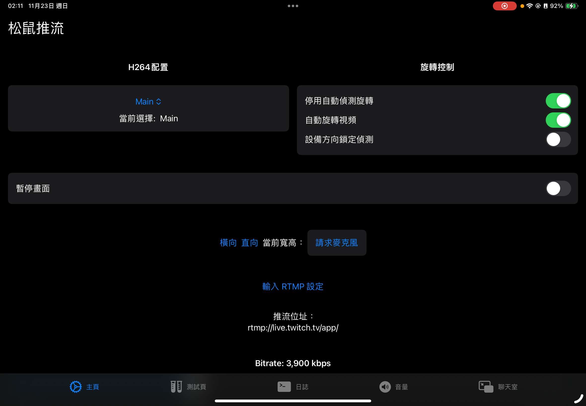
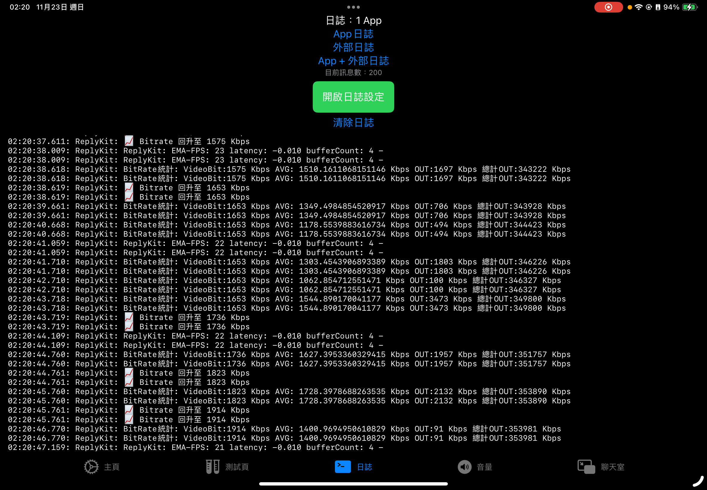
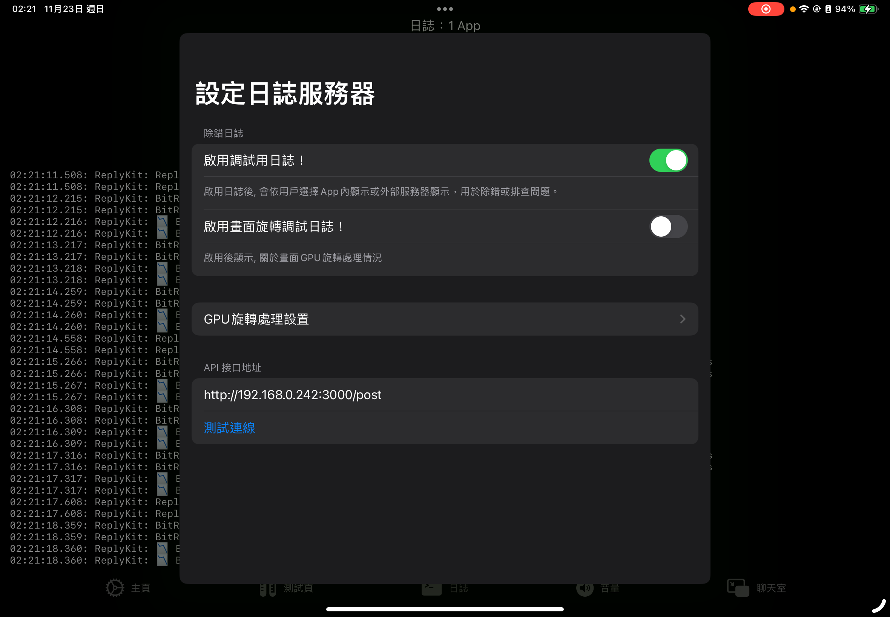
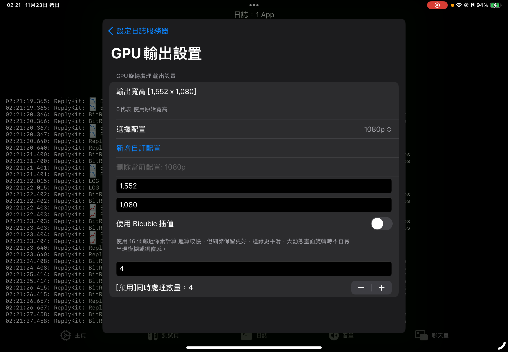
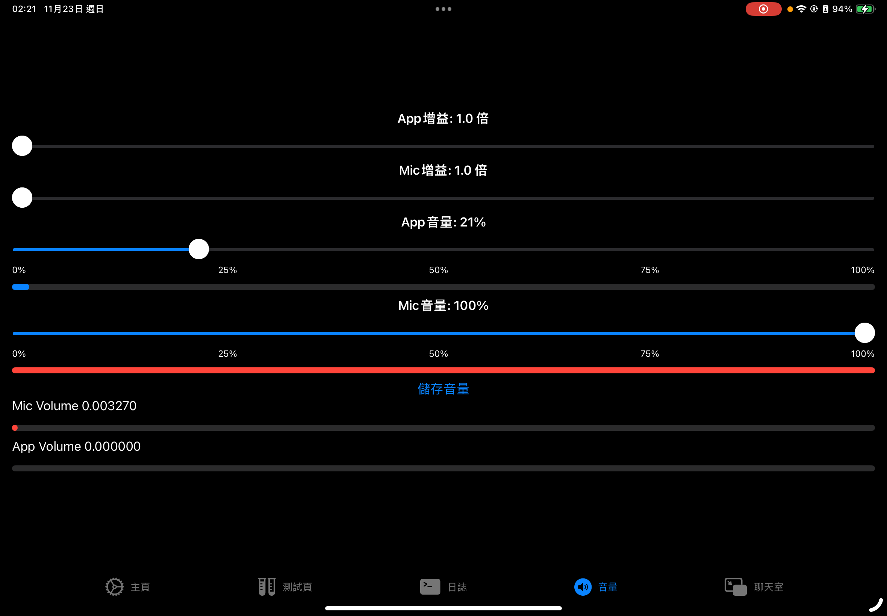

# 松鼠🐿️推流

適用於iOS的直播推流應用

## TODO 待辦事項

- **子母畫面聊天室**  
  - 實現聊天室畫面以 PiP (Picture-in-Picture) 方式呈現
  - 確保聊天室訊息即時更新與渲染

- **App Group 的替代方案**  
  - 使用 Socket 同步擴展之間的參數變化
  - 研究替代 App Group 的資料共享方法

## 調試用設定

## GPU旋轉處理設定

### 為什麼需要旋轉處理？

由於原始 **ReplyKit** 只提供直向畫面，若需要橫向畫面，必須進行 GPU 畫面旋轉處理。  

### 可設定參數

- **輸出寬高**：可自定義輸出畫面的寬度與高度。
- **插值方式**：使用 **Bicubic 插值**  
  - 運算較慢，但保留細節更好  
  - 對大動態畫面可減少模糊

### 參考分辨率對應表

| 寬度 | 高度 | 解析度 |
| --- | --- | --- |
| 1034 | 720  | 720p  |
| 1552 | 1080 | 1080p |

## 音訊設定

在此頁面，你可以：

- **控制麥克風或應用的增益與音量大小**  
- **查看直播時的實際輸出音量**，方便即時監控音訊狀態